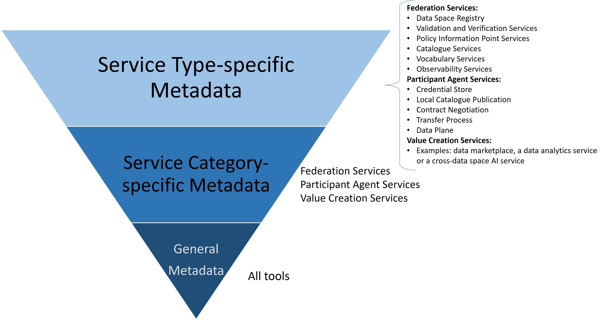

# Dataspaces Tool Catalog Application Profile (DS-TCAT-AP) and Semantic Models

- This repository primarily hosts the Application Profile (DS-TCAT-AP) for the [DSSC](https://dssc.eu/)
Dataspaces Toolbox, currently available at https://toolbox.dssc.eu/.
- In addition, it contains ontologies, controlled vocabularies, and semantic application profiles required for DS-TCAT-AP, all developed following the [AP-first methodology](https://www.semantic-web-journal.net/content/semantic-data-modeling-dataspaces-extensible-culture-information-model-and-ap-first).

---

## DS-TCAT-AP

**DS-TCAT-AP** is an application profile (AP) for modeling metadata for the DSSC Dataspaces Toolbox. It aims to enable advanced discovery of tools based on rich, multi-parameter queries.
It defines:

- **General metadata elements** (e.g., title, version, provider, license)
- **DSSC service category-specific metadata** (Federation Services, Participant Agent Services, and Value Creation Services)
- **DSSC service-specific metadata** (e.g., tools of type *Vocabulary Service* within the *Federation Services* category)

**Metadata Layers**:  
The following figure illustrates the inverted pyramid of the three metadata specification layers.

---

## Repository Contents

- **Application Profile**
    - DS-TCAT-AP
- **Ontologies and Controlled Vocabularies**
    - DSSC ontology and vocabularies to model concepts from the DSSC Dataspaces Blueprint (e.g., Building Blocks, Dataspace Services)
    - TCAT ontology: a lightweight ontology for any software tools catalog
    - DS-TCAT ontology: extends TCAT to capture dataspace-specific concepts
        - Service-specific modules (e.g., Vocabulary Service module, Participant Agent Service module)
- **Controlled vocabularies** for representing enumerations
- **Competency questions** for scoping and validating the models (Issues and discussions)
- **Example instances and queries** (SPARQL queries based on competency questions)
- **Documentation** (Currently, in README files)

---

## Namespaces and Prefixes

- Root: `https://w3id.org/dataspaces/` → `https://github.com/Fraunhofer-FIT-DSAI/ds-tcat-ap`
- Ontologies: `https://w3id.org/dataspaces/ont/`
- Controlled Vocabularies: `https://w3id.org/dataspaces/vocab/`
- Application Profiles: `https://w3id.org/dataspaces/ap/`

**Specific Models**:
- DS-TCAT-AP: `https://w3id.org/dataspaces/ap/ds-tcat-ap/`
- DSSC Ontology: `https://w3id.org/dataspaces/ont/dssc/`
- TCAT Ontology: `https://w3id.org/dataspaces/ont/tcat/`
- DS-TCAT Ontology: `https://w3id.org/dataspaces/ont/ds-tcat/`

---

## File & Directory Naming Conventions
- Use **all lowercase**
- Separate words with **hyphens (-)**
- Examples: `ds-tcat-ontology.ttl`, `visual-models`

---

## Versioning Strategy
Semantic Versioning **2.0.0**: 
`MAJOR.MINOR.PATCH`
- **MAJOR (1.x.x)**: Breaking changes to ontology structure
- **MINOR (x.1.x)**: New classes/properties (backward compatible)
- **PATCH (x.x.1)**: Bug fixes, documentation updates

---

## Existing Data Models Collection

This collection serves as the **first reference** for ontology development.  
It is a **living document**, continuously maintained and enhanced.

| Data Model | Prefix / URI | Links | Comment |
|------------|--------------|-------|---------|
| DCMI Terms | dcterms: http://purl.org/dc/terms/ | [Link](http://purl.org/dc/terms/) | dc is a subset of dcterms |
| DCMI Elements | dc: http://purl.org/dc/elements/1.1/ | | |
| DCMI Type | dcmitype: http://purl.org/dc/dcmitype/ | | |
| DCMI Dcam | dcam: http://purl.org/dc/dcam/ | | |
| Software Metadata Recommended Format Guide (2022) | | [Link](https://www.researchgate.net/publication/358423719_Software_Metadata_Recommended_Format_Guide) | |
| ADMS (2013) | adms: http://www.w3.org/ns/adms# | [Link](https://www.w3.org/TR/vocab-adms/) | |
| SPDX | spdx: http://spdx.org/rdf/terms | [Link](https://spdx.dev/) | |
| Schema.org | schema: https://schema.org/ | [Link](https://schema.org/SoftwareApplication) | |
| Smart Data Models | | [Link](https://smart-data-models.github.io/dataModel.DataSpace/) | |
| DCAT v3 | dcat: https://www.w3.org/TR/vocab-dcat-3/ | | |
| FOAF | foaf: http://xmlns.com/foaf/0.1/ | [Link](http://xmlns.com/foaf/spec/) | |

---

## Advantages and Characteristics

Benefits of semantic metadata models over traditional JSON Schema:

- **Improved discovery** via semantic search & reasoning
- **Synonym-based retrieval** (e.g., *Participant Agent* ~ *Connector*)
- **Hierarchical reasoning** (e.g., search for *Federation Services* → also finds *Vocabulary Services*, etc.)
- **Advanced querying** with SPARQL
- **Cross-domain interoperability** across knowledge graphs
- **Human-readability**: reuse of known vocabularies (DCMI, Schema.org)
- **Linked Data advantage**: machine-readable, RDF-based descriptions enable integration with other catalogs
- **Extensibility**: easily extendable with new classes, vocabularies, and modules

---

## References

[1] [DSSC Dataspaces Blueprint and Building Blocks](https://dssc.eu/page/knowledge-base) 
[2] [DSSC Dataspaces Services (Blueprint v2.0)](https://dssc.eu/space/BVE2/1071254998/) 
[3] [DSSC Dataspaces Toolbox](https://toolbox.dssc.eu/)

---